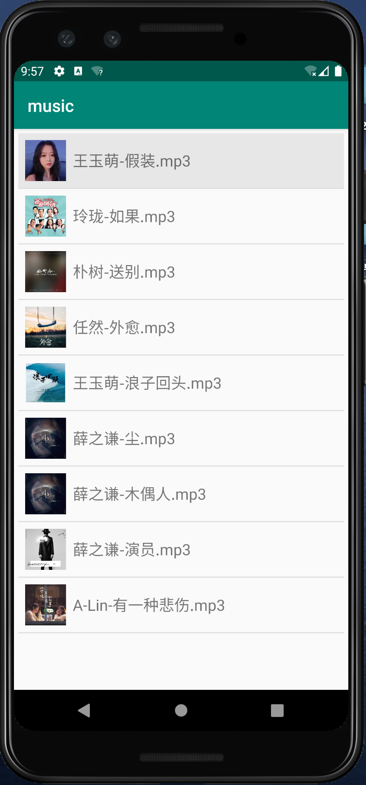
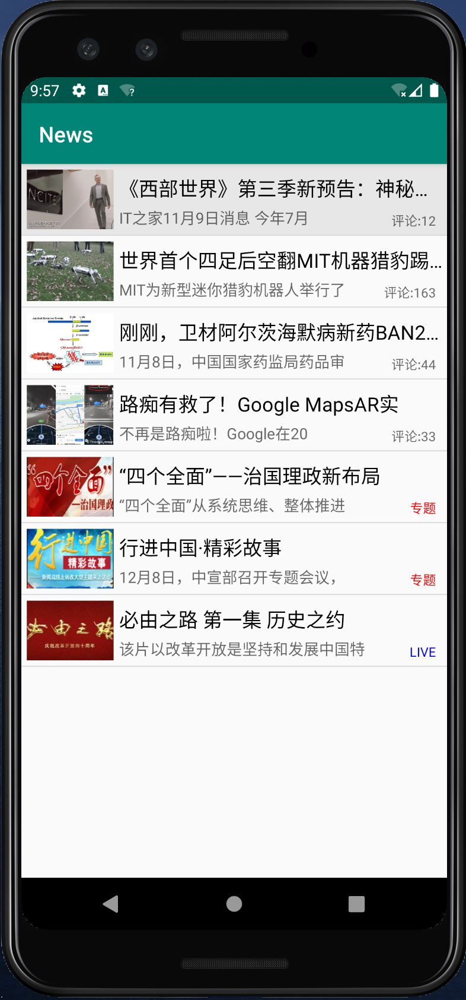

## 移动应用开发课程设计
### 音乐播器的实现&&新闻客户端的实现

- 音乐播器  
综合运用UI界面设计、数据存储、Activity(活动)、Service（服务）、MusicPlayer、ListView等知识，设计开发一款具有音乐列表的音乐播放器。
音乐播放功能使用服务进行本地通信来实现，首先需要创建一个Service类，该类会提供一个onBind()方法，onBind()方法的返回值是一个IBinder对象，IBinder对象会作为参数传递给ServiceConnection类中onServiceConnected(ComponentName name,IBinder service)方法，这样访问者就可以通过IBinder对象与Service进行通信。
- 新闻客户端  
1）配置服务器
开启Tomcat服务器，将JSON文件放入到Tomcat的webapps/ROOT文件夹中，由于每条新闻都包含一张图片，因此需要在ROOT文件夹中创建一个img文件夹用于放置这些图片。
2）JSON文件的解析
新建一个文本文件，指定文件名为NewsInfo并将扩展名修改为.json，此时便完成JSON文件的创建。该文件用于存放图片路径、新闻标题、新闻描述、新闻类型和评论数量等属性。
3）AsyncHttpClient的使用
由于访问网络是一个耗时的操作，在主线程中操作会出现假死或者异常等情况，影响用户体验，因此Google规定Android 4.0以后访问网络的操作都必须放在子线程中。但在Android开发中，发送、处理HTTP请求十分常见，如果每次与服务器进行数据交互都需要开启一个子线程，这样是非常麻烦的。为此，可以使用开源项目——AsyncHttpClient。
4）SmartImageView的使用
SmartImageView的出现主要是为了加速从网络上加载图片，它继承自Android自带的ImageView组件，另外它还提供了一些附加功能，例如：支持根据URL地址加载图片，支持加载通讯录中的图片，支持异步加载图片，支持图片缓存等。
在使用SmartImageView之前，同样需要将SmartImageView的jar文件导入项目中。
5）ListView的 item布局
由于使用到了ListView控件，因此需要为ListView的item创建一个布局news_item。
6）VideoView视频播放器
在Android中，播放视频主要使用VideoView，其中VideoView组件播放视频最简单，它将视频的显示和控制集于一身，因此，借助它就可以完成一个简易的视频播放器。
